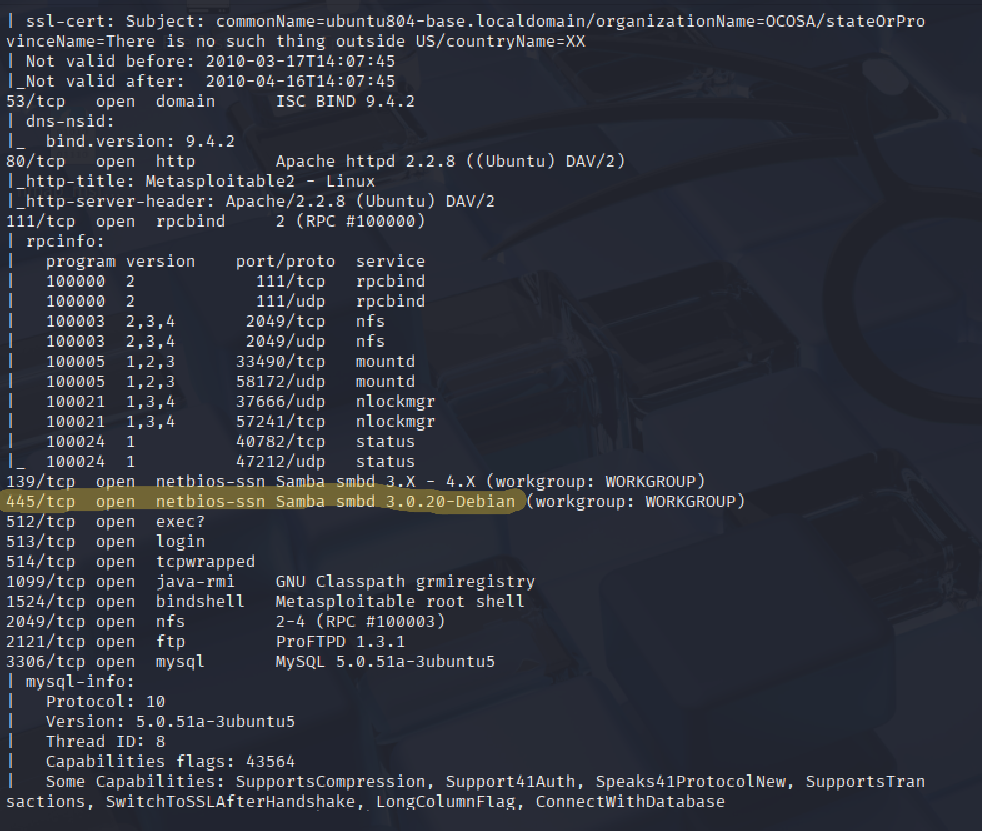
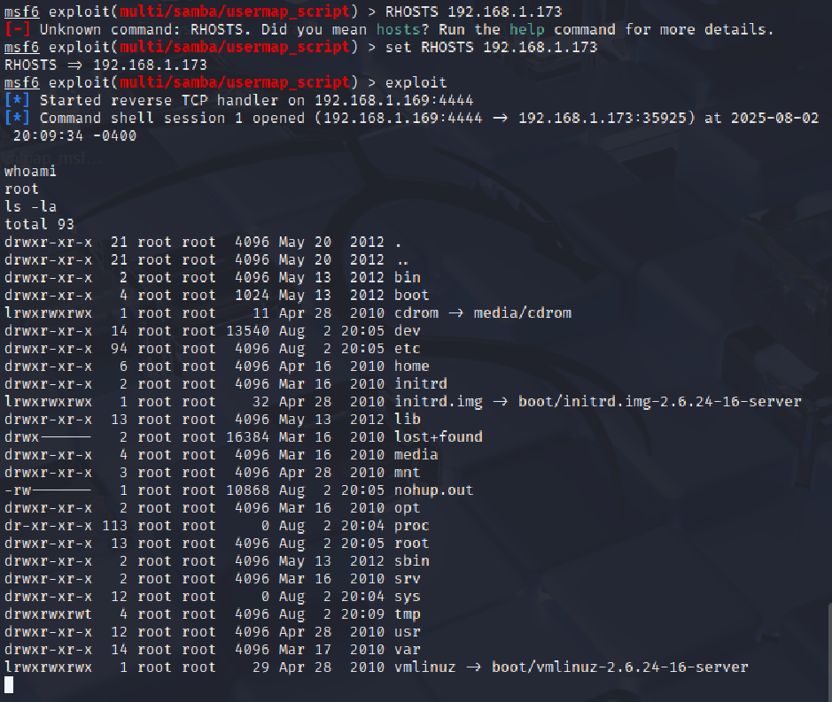
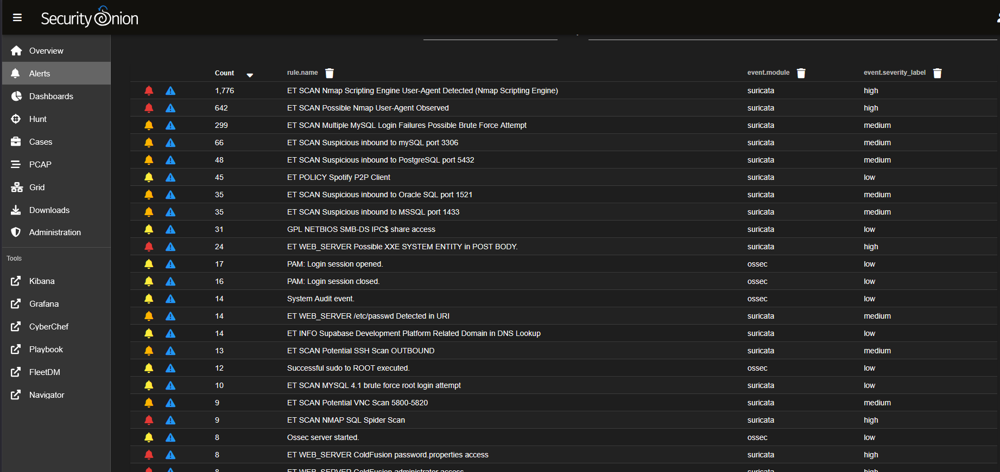
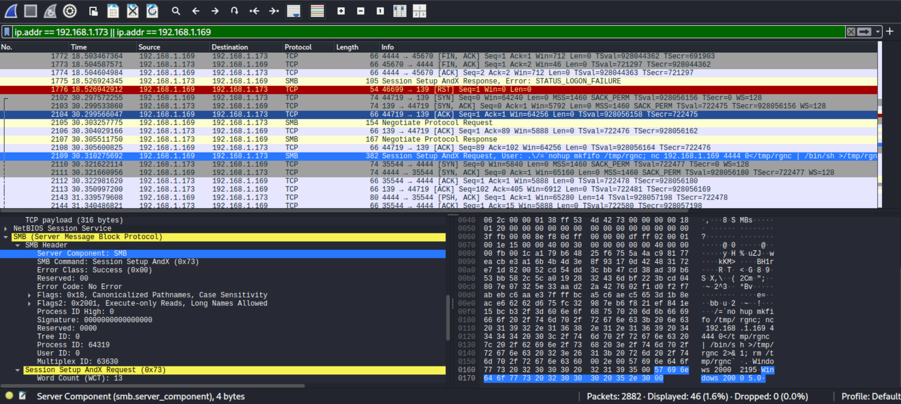

# cybersecuritylab-red-vs-blue-v1
A virtual lab simulating Samba exploitation and defensive detection with SIEM
# 🛡️ Enterprise Security Lab: Simulated Samba Exploitation

---

## 📝 Summary

This project demonstrates a full-spectrum cybersecurity exercise, combining **Red Team** offensive tactics with **Blue Team** defensive analysis. I built a lab environment using VirtualBox to simulate a remote code execution attack on a vulnerable Samba service and then used a **SIEM** to detect and analyze the incident.

---

## 📖 Project Background & Insights

This project was built to create an immersive, hands-on learning environment demonstrating both offensive and defensive cybersecurity principles. The lab mimics a real-world scenario in which a vulnerable network service can be targeted and exploited by a malicious actor. By stepping into the roles of both attacker (Red Team) and defender (Blue Team), I developed a holistic understanding of how attacks are executed, detected, and remediated in a modern security operations context.

A key technical challenge in this lab was not just carrying out the exploitation, but configuring and validating the defensive infrastructure. Security Onion, my SIEM platform, required some troubleshooting to ensure Suricata was actively monitoring traffic, leveraging up-to-date rule sets, and logging actionable alerts to the Kibana dashboard. This process deepened my understanding of how detection tools operate beneath the surface. The successful real-time detection of both the Nmap reconnaissance and the Metasploit exploit served as a critical milestone, confirming my defensive setup was effective.

This project provided a complete incident response lifecycle experience from initial attack simulation (“fire”), to detection (“alarm”), through investigative analysis and formal reporting. Analyzing logs and alerts in Kibana and Wireshark allowed me to map the attacker’s Tactics, Techniques, and Procedures (TTPs) and connect them to the MITRE ATT&CK framework. Documenting my findings in a comprehensive post-mortem report rounded out the cycle, demonstrating not just technical execution but the structured, analytical thinking and clear communication required in a professional cybersecurity role.

---

## 🖥️ Lab Infrastructure

| Machine            | OS               | IP Address       | Purpose         |
|--------------------|------------------|------------------|-----------------|
| Attacker           | Kali Linux       | `192.168.1.169`  | Offensive Ops   |
| Victim             | Metasploitable2  | `192.168.1.173`  | Target System   |
| SIEM/Monitoring    | Security Onion   | `192.168.1.166`  | Detection/Logs  |
| Hypervisor         | VirtualBox       | _N/A_            | Host Platform   |

---

## 🛠️ Methodology

1. Reconnaissance – Port scan and enumeration with Nmap  
   
2. Exploitation – Samba RCE using Metasploit  
   
3. Detection – Suricata alerts in Security Onion  
   
4. Forensic Analysis – Kibana log analysis and Wireshark  
   
   
5. Reporting – [Full Post-Mortem Report](post_mortem.pdf)

---

## 🗝️ Key Findings

- Offensive actions (Nmap, Metasploit) successfully exploited the Samba vulnerability.
- SIEM (Security Onion) detected the attack in real time (Suricata/Zeek).
- Full incident analysis aligned with the [MITRE ATT&CK](https://attack.mitre.org/) framework.
- Post-mortem report provided actionable recommendations.

---

## 📂 Evidence

- [Red Team Screenshots](screenshots/red_team/)
- [Blue Team (Kibana/Suricata) Screenshots](screenshots/blue_team/)
- [Wireshark PCAP Screenshots](screenshots/wireshark/wireshark_pcap.png)
- [Full Post-Mortem Report (PDF)](post_mortem.pdf)

---

## ⚡ Technologies Used

---

## 📊 MITRE ATT&CK Mapping

| Tactic             | Technique                  | Tool/Action                     |
|--------------------|---------------------------|---------------------------------|
| Reconnaissance     | Active Scanning           | Nmap                            |
| Initial Access     | Exploit Public-Facing App | Metasploit (Samba RCE)          |
| Execution          | Command & Script Interp.  | Meterpreter shell               |
| Defense Evasion    | Indicator Removal         | Manual actions                  |
| Discovery          | System Network Discovery  | Post-exploitation enumeration   |
| Collection         | Data from Info Repos      | Manual commands                 |

---

## 📢 Contact

- [LinkedIn](https://www.linkedin.com/in/mo-alam9)
- [Email](mailto:mofhhs2018@gmail.com)

---

> “Security is not a product, but a process.” – Bruce Schneier
